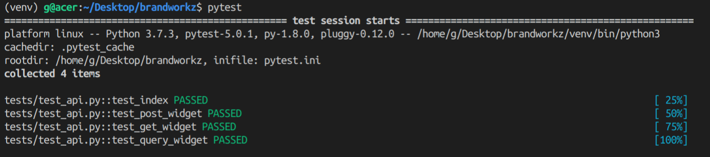

# Giovanni Di Noia assignment for Brandworkz.

1. Do not renvent the wheel: we start from the [boilerplate](https://github.com/tko22/flask-boilerplate) provided by Timothy Ko which contains almost all the best practices suggested by the Flask community and a lot of match with prefered tools: docker with hot reload, black as formatter, pylint, pytest and the flask ecosystem.
2. Fastest way to try the app is using docker compose and in particular the command `make up`.              
   Assuming that you have *python3*, *docker* and *docker-compose* installed, 

        python3 -m pip install virtualenv
        python3 virtualenv venv
        source /venv/bin/activate
        make up

3. In order to run the unittests you need to install some python packages and run pytest:

        python3 -m pip install -r requirements.txt
        python3 -m pip install -r requirements-dev.txt
        pytest
    
    

4. There is the beginning of e2e test file to populate the DB trough a post request to the app.

        python3 scripts/populate_db.py

5. Unfortunately, the localization isn't tested yet but it is fully implemented.
